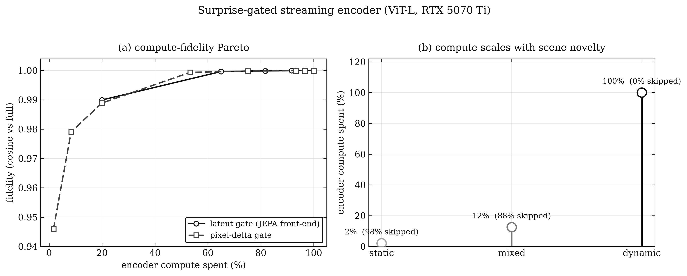
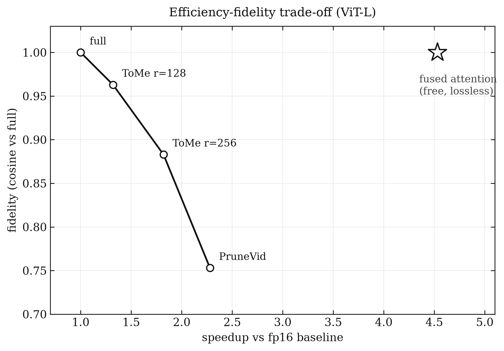
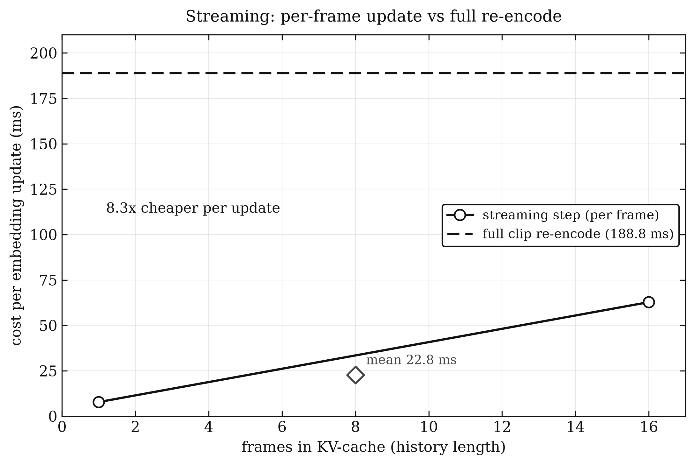

# Saccade

Most of a video is redundant (a hallway camera sees nearly the same frame thousands of times),
yet a video model normally pays full price for every frame. That makes running V-JEPA 2 live on
edge hardware (cameras, robots, on-device apps) expensive.

Saccade fixes that by spending compute only on what changes, the way your eyes spend detail on
fixations and predict across the jumps in between (a saccade). It turns a frozen V-JEPA 2 encoder
into a streaming model that keeps a live embedding cheaply.

## How it works

Saccade adds two things to V-JEPA's encoder:

1. **A streaming, causal encoder.** Attention is made block-causal and backed by a per-layer
   KV-cache, so a new frame is encoded once and reuses cached history instead of re-running a
   sliding window. V-JEPA 2's 3D rotary embeddings are ported into the causal path, so the cached
   step reproduces the original full-attention output exactly, not an approximation.
2. **Surprise-gating.** A cheap novelty test (the encoder's own patch-embedding front-end) decides
   whether an incoming clip is actually new. Predictable clips skip the transformer and reuse the
   last representation; only real changes pay full price. Compute follows the scene, not the clock.

<p align="center"></p>

<p align="center"><em>Left: the learned gate holds fidelity far better than a pixel-difference gate as compute drops. Right: encoder compute auto-scales from ~2% on static video to 100% on fast motion.</em></p>

Around that core sits a measured edge toolkit: post-training quantization (int8/int4), token
reduction (ToMe, PruneVid-style temporal merge), fused attention + `torch.compile`, distillation
to a smaller ViT-S student, ONNX export, and an async decode-and-infer pipeline.

## Results

Measured on an RTX 5070 Ti, fp16, batch 1. A single GPU, not the Jetson target, so read these as
a correctness check and an upper bound on edge performance.

<p align="center">
  
  
</p>

| What | Result |
|------|--------|
| ViT-L encoder (16f @256) | 95.7 ms, 10.5 embeds/s, 738 MB |
| Surprise-gated streaming (real video) | 84% of embeddings skipped, 5.7x faster |
| Streaming per-frame update | 22.8 ms vs 188.8 ms full re-encode = 8.3x |
| RoPE-port correctness | causal attention matches HF to rel 0.001; cache step exact (0.0) |
| Fused attention | SDPA 3.94x, SDPA + torch.compile 4.53x vs eager (374 -> 82 ms) |
| int8 quantization | 30% less memory at cosine 0.9999 |
| Token reduction | 1.3x to 2.3x speedup (accuracy/speed knob) |
| ONNX export | exact parity vs PyTorch (cosine 1.00000) |

## Install

Requires Python 3.10+ and a CUDA GPU. Uses [uv](https://docs.astral.sh/uv/); torch comes from the
cu128 index (Blackwell/sm_120), configured in `pyproject.toml`:

```bash
uv sync                # creates .venv and installs deps (incl. cu128 torch)
uv sync --extra dev    # add test + figure tooling (pytest, matplotlib, seaborn)
```

On Jetson, install the JetPack-provided `torch`/`decord`/`tensorrt` wheels instead.

## Quickstart

Encode a clip:

```python
import torch
from saccade import load_encoder, ModelConfig

enc = load_encoder(ModelConfig(checkpoint="vitl", frames=16, resolution=256,
                               device="cuda", dtype="float16"))
clip = torch.rand(1, 16, 3, 256, 256, device="cuda", dtype=torch.float16)  # [B,T,C,H,W]
emb = enc.embed(clip)        # [1, 1024]
```

Surprise-gated streaming (encode only when the scene changes):

```python
from saccade import SurpriseGatedEncoder

gate = SurpriseGatedEncoder(enc, tau=0.015)   # tau is the compute/fidelity knob
gate.reset()
for clip in clips:                            # clip: [1, T, 3, H, W]
    emb, info = gate.step(clip)               # info["encoded"] == False -> reused last latent
```

For exact causal streaming with a KV-cache, use `apply_causal_lora(enc, StreamingConfig(...))`
then `StreamingEncoder`.

## Reproduce

The numbers above come from these scripts (run on an RTX 5070 Ti):

```bash
uv run python scripts/real_eval.py            # encoder latency + streaming
uv run python scripts/bench_fused_attn.py     # eager vs SDPA vs torch.compile
uv run python scripts/bench_surprise_gate.py  # surprise-gating Pareto
uv run python scripts/verify_rope.py          # RoPE-port correctness checks
uv run python scripts/make_figures.py         # render result figures
uv run python scripts/demo.py --video clip.mp4 --stride 4 --tau 0.015  # annotated demo
uv run pytest                                 # unit tests
```

Layout: the library lives in `src/saccade/` (with `streaming/` for the causal attention, KV-cache,
LoRA-to-causal, streaming encoder and surprise gate); `scripts/` holds the benchmarks and demo;
`tests/` the unit tests; `configs/` example run configs.

## Status and limitations

Measured and verified:

- Encoder latency/throughput/memory, fused attention, token reduction, int8 quantization.
- Streaming: the KV-cache step reproduces masked full attention exactly; the ported 3D-RoPE matches
  the reference encoder to ~0.1%.
- 37 unit tests pass (core correctness plus the novel features); distillation and the robustness
  finetune train on the real model.

Not yet done (needs external resources, not code):

- **Task accuracy.** SSv2 top-1 has not been run (the dataset is gated). The probe train/eval
  harness works on a synthetic proxy; there are no accuracy-vs-SOTA numbers yet.
- **On-device.** Only a single GPU was used; Jetson latency and a TensorRT engine still need the
  actual device.
- **Streaming accuracy.** The causal encoder is numerically exact through the cache, but a LoRA
  finetune on real video is still needed to close the across-depth causal-vs-bidirectional gap.

## References

- V-JEPA 2, Assran et al., 2025 (arXiv:2506.09985). Checkpoints `facebook/vjepa2-*` on Hugging
  Face; Saccade loads `facebook/vjepa2-vitl-fpc64-256` by default.
- Closest streaming prior art: VL-JEPA, OmniStream, Recurrent Video MAE, CarelessWhisper.

## License

MIT, see [LICENSE](LICENSE).
